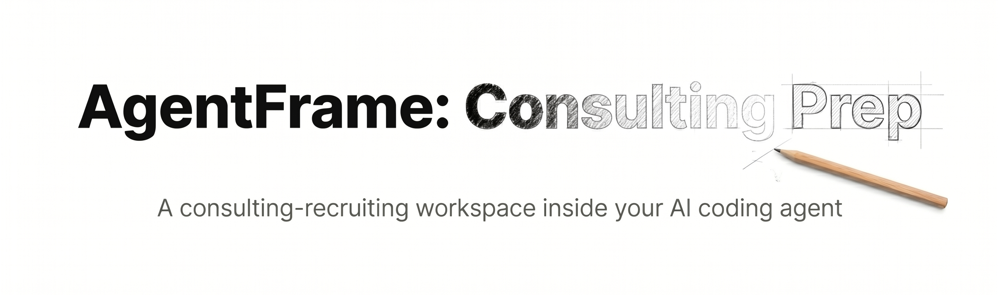
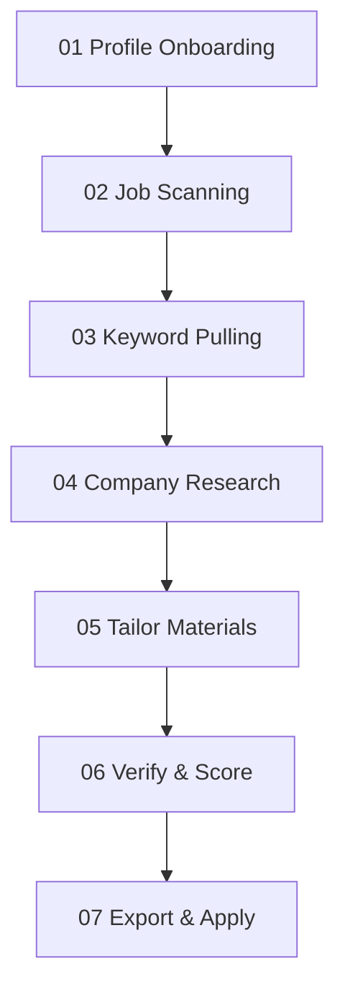

# Extern: Resume & Job Search Agent

<p align="center">
  
</p>

> **A personalized workspace and tailoring engine that lives inside your AI coding agent.** Tailor your resume, generate cover letters in your voice, research target companies, run strict mock ATS evaluations, and track your applications.

> Works with any agent that reads `AGENTS.md` (e.g. Claude Code, Gemini, Cursor, VS Code).

**Jump to**: [The Pipeline](#the-7-step-pipeline) · [Quick Start](#quick-start) · [System at a Glance](#system-at-a-glance) · [How it Works](#how-it-is-put-together) · [Connectors](#connectors)

---

## What this is (and isn't)

This is a **starting template** for running your job search like a product. Instead of using generic prompt packs or paying for subscription-based resume wrappers, this repository provides a file-native, prompt-open system. You have direct access to every skill (saved in `skills/`), which means you can edit, break, and customize the agent's behavior.

The gap between a basic prompt and a personalized agent is where the learning happens. By customizing the skills, refining your voice profile, and tweaking the verification rules, you build a custom tool that you own and can discuss in interviews as a portfolio piece showing you can build and direct real AI systems.

---

## The 7-Step Pipeline

The agent helps you walk through a structured, end-to-end recruitment process (detailed in [workflow.md](library/process/workflow.md)):



1.  **Profile Onboarding**: Set up your master CV, STAR stories, and voice profile in `library/context/` so the agent knows who you are and how you write.
2.  **Job Scanning**: Scan for job opportunities using `find-job` to scrape job details and create a target application tracking folder.
3.  **Keyword Pulling**: Extract the primary ATS keywords and core competencies from the Job Description.
4.  **Company Research**: Generate a Gemini Deep Research prompt using `company-research` and paste the brief into your application directory to understand company culture, initiatives, and technical challenges.
5.  **Tailor Materials**: Generate a customized, keyword-aligned resume (`cv`) and cover letter (`cover-letter`) matching your voice.
6.  **Verify & Score**: Run a mock ATS screening audit using `verifier` to score your resume (0-100) and scan your cover letter for word limits and generic AI tells before submission.
7.  **Export & Apply**: Render your materials into ATS-safe, clean HTML pages using `doc-export`, print them to PDF from your browser, and mark the job as applied in `tracker.md`.

---

## Quick Start

### 1 — Install VS Code
Download and install [VS Code](https://code.visualstudio.com/), a free code editor. You won't need to write code — it's just the home for your agent.

### 2 — Configure Your AI Agent
Add a coding agent extension. **Claude Code** is recommended, but other `AGENTS.md`-aware setups like Cursor, Gemini, or Codex also work. Connect your account and open the workspace.

### 3 — Setup Your Candidate Profile
The repository starts with empty `FILL-ME` templates in `library/context/`. When you first tell the agent to tailor a resume, it will notice they are blank and guide you through onboarding:
*   Paste your current resume to build `library/context/master-cv.md`.
*   Input your target roles and location in `positioning.md`.
*   Paste sample emails/writing to set up the voice profile in `voice/`.
*   Add 2-3 behavioral STAR stories in `stories/`.

### 4 — Run Your First Application Tailoring
Copy a job description URL or text, open the agent, and say:
> *"Tailor my resume for this Job Description: [paste text or URL]"*

The agent will scan the job, extract keywords, draft the CV and cover letter, and tell you how to verify them!

---

## System at a Glance

### Skills (`skills/`)
Each skill is a folder containing a `SKILL.md` file. They are simply prompt systems — you can open and edit them at any time.

| Skill | What it does |
| :--- | :--- |
| `find-job` | Scans a job listing and seeds the application directory and tracker row. |
| `company-research` | Writes a best-practice research prompt to create a cited brief on the company's business. |
| `cv` | Tailors a single-page, keyword-dense resume from your master CV. |
| `cover-letter` | Drafts a one-page cover letter matching your natural tone; drafts outreach emails. |
| `verifier` | Audits tailored materials. Scores resumes (0-100) based on complexity and link quality; flags generic AI tells in letters. |
| `doc-export` | Exports finished markdown into print-ready, ATS-safe HTML/PDF templates or `.docx` files. |
| `learn` | Feeds your manual edits back into your voice profile as before/after pairs. |
| `builder` | The system-configuration mode used when you want the agent to add new skills or modify behavior. |

### Repository Structure

```text
extern-resume-and-job-search-agent/
├── AGENTS.md                 # Master agent rules, routing, and workflows
├── CLAUDE.md                 # Minimal Claude Code loader
├── README.md
├── .env.example              # Optional Composio keys
├── library/
│   ├── context/              # Your CV, stories, voice profiles, target positioning
│   └── process/
│       └── workflow.md       # The 7-step pipeline definition
├── skills/                   # Tailoring, research, verifier, learn, and export prompts
└── workspace/
    └── applications/
        ├── tracker.md        # The application tracking funnel (status: target, researching, tailored, verified, applied)
        └── EXAMPLE-meridian-business-analyst/ # Sample tailored application folder
```

---

## How it is Put Together

*   **File-Native**: Your CV, stories, positioning, and applications exist as local markdown files. The agent always knows where to pick up, and you maintain a permanent, offline record of your search.
*   **Token-Efficient**: The agent only reads what is needed for the active step (e.g. reading only the STAR story headers instead of the full bodies during selection) to keep API costs low and prevent model hallucination.
*   **Print-to-PDF Formatting**: To avoid MS Word formatting breaking, the `doc-export` skill generates clean HTML. Printing this HTML file from your browser (Ctrl/Cmd+P → Save as PDF) yields a perfect, single-page, ATS-safe PDF.

---

## Connectors

Connect **Composio** to allow the agent to interface with your Google Docs, Gmail, or Calendar accounts. The agent can then automatically push tailored resumes to Google Docs or prepare draft follow-up emails in your Gmail draft folder. Full setup instructions are located in [connectors.md](library/context/connectors.md).

---

## License

**MIT** — see [LICENSE](LICENSE) for details. Helper libraries (`skills/docx/` and `skills/humanizer/`) carry their respective open-source licenses.
