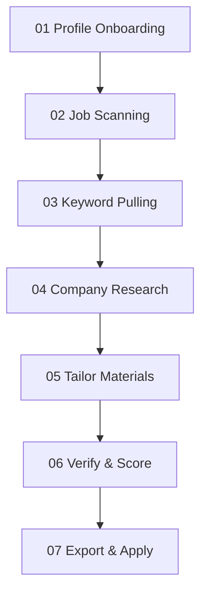

# Extern Recruitment Workflow: Resume & Job Search Pipeline

This document defines the 7-step pipeline for preparing job applications. Every application should progress through these stages, ensuring that the candidate's profile is fully aligned, the company is researched, and the materials are rigorously verified before submission.

---

## The 7-Step Pipeline

### Stage 1: Profile Onboarding (Know Your Profile)
*   **Goal**: Establish a baseline of the candidate's experience, target track, and natural writing voice.
*   **Artifacts**:
    *   `library/context/master-cv.md` (Uncut bullets containing all experience and metrics).
    *   `library/context/positioning.md` (Target role, track, location, and candidate summary).
    *   `library/context/voice/` (Anti-patterns, intake corpus, and voice profile).
    *   `library/context/stories/` (A roster of 2-3 behavioral STAR stories).
*   **Check Marker**: All profile files must be filled (no `FILL-ME` stubs remaining) before starting tailoring.

### Stage 2: Job Scanning (Scan for Jobs)
*   **Goal**: Discover active opportunities that match the candidate's targeting.
*   **Artifacts**:
    *   `workspace/applications/tracker.md` (Application tracking dashboard).
    *   A target folder `workspace/applications/{company}-{role}/` containing the Job Description (`jd.md`).
*   **Action**: Use the `find-job` skill to pull a job description and seed a row in the tracker with `status: target`.

### Stage 3: Keyword Pulling (Analyze the Role)
*   **Goal**: Extract core competencies, skills, and ATS-relevant keywords from the job description.
*   **Artifacts**:
    *   `workspace/applications/{company}-{role}/application.md` (Contains parsed details and target keywords).
*   **Check Marker**: Identify 10-15 primary and secondary keywords/skills that must appear in the final CV and cover letter.

### Stage 4: Company Research (Research the Company)
*   **Goal**: Create a cited research brief on the target company's business model, latest initiatives, culture, and key projects to inform cover letter drafting and interview prep.
*   **Artifacts**:
    *   `workspace/applications/{company}-{role}/research-brief-v1.md`
*   **Action**: Generate a Deep Research prompt using the `company-research` skill, run it, and save the results with references.

### Stage 5: Tailoring Materials (Tailor CV & Letter)
*   **Goal**: Generate a customized resume and cover letter that map the candidate's experience directly to the job description keywords.
*   **Artifacts**:
    *   `workspace/applications/{company}-{role}/cv-v1.md` (Customized single-page resume).
    *   `workspace/applications/{company}-{role}/cover-letter-v1.md` (Customized cover letter using the candidate's natural voice and positioning).

### Stage 6: Verification & Scoring (Verify & Score)
*   **Goal**: Run a strict, HackerRank-style mock ATS evaluation to audit the tailored CV and cover letter, providing an objective score and identifying improvements before exporting.
*   **Artifacts**:
    *   `workspace/applications/{company}-{role}/cv-verification-report.md`
    *   `workspace/applications/{company}-{role}/cover-letter-verification-report.md`
*   **Action**: Run the `verifier` skill to grade:
    *   *Resume (0-100)*: Open Source/Projects (35), Self Projects (30), Production Work (25), Technical Skills (10). Deducts points for tutorial projects, missing links, or generic titles.
    *   *Cover Letter*: Checks for length, formatting, company alignment, and generic AI tells.

### Stage 7: Export & Application (Export & Apply)
*   **Goal**: Turn the finalized markdown materials into submission-ready PDF or Word documents.
*   **Artifacts**:
    *   `workspace/applications/{company}-{role}/cv-v1.html` and `cv-v1.pdf` (Rendered using the ATS-safe HTML template).
    *   `workspace/applications/{company}-{role}/cover-letter-v1.html` and `cover-letter-v1.pdf`.
*   **Action**: Run the `doc-export` skill to create the HTML/Word files, use `scripts/export_pdf.mjs` to automatically compile them to PDF (or fall back to browser print-to-PDF manually), and update `tracker.md` to `status: applied`.
